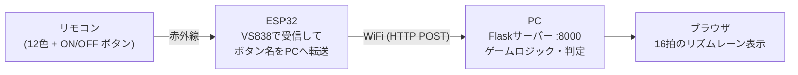

# sensor_infrared — 100円ショップのLEDライトで作るリズムゲーム

100円ショップで売っているリモコン式LEDライト(300円)を分解し、中の赤外線受信部品とリモコンを
**リズムゲームのコントローラー**に変身させるプロジェクトです。

- 📖 **制作記事(なぜ作ったか・どう作ったか): https://sensor-infrared.vercel.app/**
- 🎮 遊び方はこのREADMEの下の方にあります

## 仕組み



ESP32は「どのボタンが押されたか」をWiFiでPCに送るだけのブリッジ役。
ゲーム本体(パターン生成・タイミング判定・スコア・ライフ管理)はPC側のPythonで動き、
画面はブラウザに表示されます。

## 必要なもの

| 品目 | 補足 |
|---|---|
| リモコン式LEDライト | 100円ショップで購入(300円商品)。中の赤外線受信部品(VS838)とリモコンを使う |
| ESP32開発ボード | ESP-WROOM-32。今回はOLED(SSD1306 128x64)一体型の ideaspark 製を使用 |
| ブレッドボード・ジャンパー線 | 受信部品とESP32の接続用 |
| WiFi環境 | ESP32とPCが同じネットワークに入れればOK(モバイルルーターでも可) |
| PC | Python 3 が動けばOK(Mac/Windows/Linux) |

## 配線

LEDライトを分解し、基板上の赤外線受信部品(VS838)から3本の線を取り出してESP32につなぎます。

| VS838(ドーム正面から見て左から) | ESP32 |
|---|---|
| OUT(信号) | GPIO27 |
| GND | GND |
| VCC(電源) | 3V3 |

OLED一体型ボードの場合、画面の配線は不要です(I2C: SDA=21 / SCL=22 をコード内で設定済み)。

> ⚠️ 分解・配線は自己責任で。電源電圧(VS838は3.3Vで動作)とプラス/マイナスの向きは
> 接続前に必ず確認してください。

## セットアップ手順

### 1. PC側(ゲームサーバー)

```bash
pip install flask
python3 pc_game/game_server.py
```

ブラウザで `http://localhost:8000/` を開くとゲーム画面が表示されます。
あわせて、ESP32から届くようにPC自身のIPアドレスを確認しておきます(Macなら `ipconfig getifaddr en0`)。

### 2. ESP32側(ファームウェア)

1. Arduino IDE に ESP32 ボードサポート(Espressif の `esp32`)を追加
2. ライブラリマネージャーから以下をインストール
   - `IRremoteESP8266`(crankyoldgit)
   - `Adafruit SSD1306` / `Adafruit GFX Library`
3. WiFi設定ファイルを作成:

   ```bash
   cp firmware/color_memory_game_wifi/wifi_config.example.h \
      firmware/color_memory_game_wifi/wifi_config.h
   ```

   `wifi_config.h` を開いて、WiFiのSSID/パスワードと、手順1で確認したPCのIPアドレス
   (`PC_SERVER_HOST`)を書き込みます。このファイルは `.gitignore` 済みなのでコミットされません。
4. `firmware/color_memory_game_wifi/color_memory_game_wifi.ino` をESP32に書き込み

起動するとOLEDにWiFi接続状況が表示され、接続に成功するとESP32のIPアドレスが出ます。

### 3. リモコンのIRコードが違う場合

リモコンの個体・製品が違うとIRコードも異なります。その場合は:

1. スケッチを書き込んだ状態でシリアルモニタ(115200bps)を開く
2. リモコンのボタンを押すと `Unknown code: 0x......` と表示される
3. その値を `color_memory_game_wifi.ino` の `COLORS[]` / `BTN_ON_CODE` / `BTN_OFF_CODE` /
   `BTN_MODE_CODE` に書き写す

## 遊び方

| ボタン | 動作 |
|---|---|
| ON | ゲーム開始 / 次のステージへ |
| 色ボタン(12色) | 流れてくるビートと同じ色を、判定ラインに重なる瞬間に押す |
| Mode | 練習モード(待機中のみ。好きな色を押して反応を確認できる) |
| OFF | 中断してタイトルに戻る |

- 全5ステージ。ステージが進むと16拍中の色付きビートが 2 → 4 → 6 → 8 → 10 個に増えます
- 判定: ピッタリ(±0.09秒)= **EXCELLENT** / 少しズレ(±0.22秒)= **OK** / それ以上・押しそびれ = ライフ−1
- ライフは3つ。なくなるとゲームオーバー、5ステージ抜ければ ALL CLEAR

## リポジトリ構成

```
firmware/
├── color_memory_game_wifi/   # ★ 現行版: IR受信→WiFiブリッジ(これを書き込む)
├── color_memory_game/        # 旧版: ESP32単体で完結する色記憶ゲーム(要WS2812配線・未解決)
├── oled_i2c_scan/            # OLEDのI2Cピンを特定する診断ツール
└── presence_light/           # 実験: 人感ライト構想のスケッチ
pc_game/
├── game_server.py            # ★ ゲーム本体(Flask)
└── templates/index.html      # ブラウザのゲーム画面
site/                         # 制作記事の公開ページ(Vercel用静的サイト)
SESSION_LOG.md                # 開発ログ(AIとのセッション記録)
```

## クレジット

作: [KeitoKuramochi](https://github.com/KeitoKuramochi) — AIアシスタント(Claude)と一緒に制作しました。
