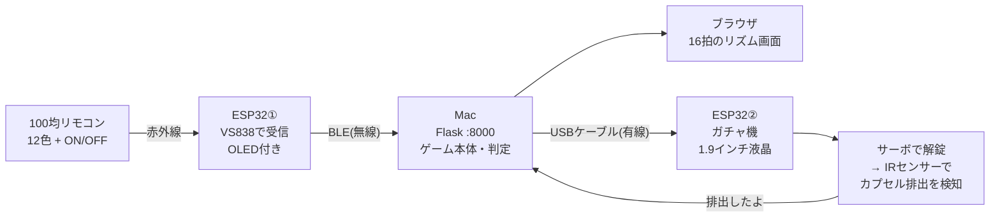

# 📌 まず読むメモ — このフォルダは何なのか

> 久しぶりに開いた自分 / 初めて見る人 が、5分でこのフォルダを理解するための1枚。
> 細かい手順は [README.md](README.md)、日々の作業記録は [SESSION_LOG.md](SESSION_LOG.md) にあります。

---

## 一行でいうと

**100円ショップで買った300円のリモコン式LEDライトを分解して、リズムゲームのコントローラーにした。
さらに友人のガチャガチャ machine と繋いで、「高得点を取ったらガチャが回せる」オープンキャンパスの出し物にした。**

- 期間: **2026年7月20日 〜 8月1日**(約2週間、64コミット)
- 状態: **完成。実際のイベントで動いた。** 現在は展示運用フェーズ
- 制作記事(公開中): https://sensor-infrared.vercel.app/

---

## 今どうなっているか(現在の構成)



| 区間 | 方式 | なぜそれか |
|---|---|---|
| リモコン → ESP32① | 赤外線 | 元からそういう製品だから |
| ESP32① → PC | **BLE(無線)** | リモコンは手に持って使うのでケーブルは無理 |
| PC ⇄ ガチャ機 | **USBシリアル(有線)** | 会場の電波事情に負け続けたので、最後に有線へ回帰した |

**遊びの流れ**: 目標点数を選ぶ(100/250/500/1000/2000点)→ 全5ステージ・16拍のリズムゲーム
→ 目標達成ならガチャのロックが解ける → ハンドルを回す → カプセルが落ちたのをセンサーが検知 → 自動で再施錠 → 「次の人どうぞ」

---

## 動かし方(3ステップ)

詳しい展示用の手順は **[`動作用.txt`](動作用.txt)** にまとめてある(キオスクモードの起動コマンド、通知の切り方など)。

```bash
# 1. サーバーを起動
cd ~/Desktop/hobby/sensor/pc_game
python3 game_server.py

# 2. ガチャ機を使うならUSBケーブルで繋ぐ(ポートは自動検出される)

# 3. ブラウザで開く(展示用の全画面)
open -na "Google Chrome" --args --kiosk --app=http://localhost:8000/
```

必要なもの: `pip install flask "bleak<3" pyserial`(**bleak 3.x はmacOSでスキャンが固まるので `<3` 必須**)

困ったときは画面右下の **🛠 管理パネル**。手動で解錠/施錠、状態確認、記録の消去、全画面切り替えができる。

---

## フォルダの歩き方

| 場所 | 中身 | 備考 |
|---|---|---|
| `pc_game/game_server.py` | **ゲーム本体**(Flask・990行) | 判定・スコア・ランキング・ガチャ連携すべてここ |
| `pc_game/templates/index.html` | **ゲーム画面**(1869行) | 見た目・演出・管理パネル |
| `firmware/color_memory_game_ble/` | ★ **現行** リモコン側ファーム | IR受信 → BLEでPCへ |
| `firmware/gacha_lock_serial/` | ★ **現行** ガチャ機側ファーム | USBシリアル。サーボ+IRセンサー+液晶 |
| `firmware/` のその他 | 旧版の墓場 | `_wifi` `_bt` `gacha_lock_ble` `gacha_lock_wifi` など。**歴史として残してある** |
| `site/` | 制作記事(個人ブログ寄り) | → https://sensor-infrared.vercel.app/ |
| `opencampus/` | オープンキャンパス用の技術解説ページ | **中身は別リポジトリ**(`opencampus-sensor-lab`)。親からは gitignore |
| `画像/` | AI生成画像・撮影素材の元データ | gitignore(重いので) |
| `SESSION_LOG.md` | 全セッションの作業記録 | 一番濃い資料。困ったら grep |
| `CLAUDE.md` | AIに守らせているルール | 下の「決まりごと」参照 |

---

## これまでの物語

### 第1章 — 100均で部品を漁る(7/20〜21)

ダイソーの300円リモコンLEDライトを分解。中の赤外線受信IC(**VS838**)のピン配置が分からず難航したが、
ユーザーがネットの分解記事を見つけてデータシートに到達し、`OUT / GND / VCC` の並びが確定。
リモコンのボタンを押しながらシリアルモニタを眺めて、12色 + ON/OFF の**赤外線コードを全部採取**した。

当初は「ESP32だけで完結する色記憶ゲーム(サイモン風)」を作っていたが、
基板から取ったRGB LEDの配線がどうしても特定できず、**ゲーム画面をPC側に移す**方向へ転換。
ESP32は「ボタンが押された」を伝えるだけの橋渡し役になった。

### 第2章 — 無線との長い戦い(7/27)

この日1日で通信方式を**3回**変えている。

1. **WiFi** — モバイルルーターを用意したが、IPアドレスを設定ファイルに書く運用が面倒
2. **Bluetooth Classic (SPP)** — 「1回しか反応しない」「幽霊接続が残る」に苦しみ、
   双方向ハートビートまで実装したが、**現行macOSのSPPサポート自体が不安定**と判明
3. **BLE** — 全面移行して解決。ペアリング不要・自動再接続・切断検知はOS任せ

ここでも2つ罠があった。①**bleak 3.0.2 のバグ**でmacOSのスキャンが永久に固まる(2.1.1へ降格して解決)
②広告パケットに名前とUUIDが両方入らず(31バイト制限)、デバイスがそもそも見つからない。

同じ日、**Purple1 / Pink / Purple2 の色ズレ**で3回も「修正」して余計に壊した。
真犯人はファームのIRコードではなく **PC側の画面レイアウトの並び順**だった。
→ この対応は `SESSION_LOG.md` で「★確定、これ以上変更しないこと」と釘を刺してある。

そして夕方、ついに **「今、できてるぞ!!!」** — リモコン→ESP32→BLE→PC→ブラウザの全経路が通った。

### 第3章 — 見た目を本気で作る(7/27)

動いた勢いのまま、ガラス調のデザインシステムで画面を全面リニューアル。
生成AIで作った画像8枚(背景・ロゴ・マスコット・ハート・結果画面など)を透過処理して組み込み、
EXCELLENT判定の瞬間に画面が光る**バースト演出**、コンボ表示、その日のランキングTOP10も追加した。

### 第4章 — ガチャガチャと繋がる(7/30〜31)

友人の [MaedaReno/gacha-machine](https://github.com/MaedaReno/gacha-machine)(ESP32+サーボでガチャのロックを外す装置)と連携。
「500点取ったらガチャが回せる」を実装した。

ここが一番の山場で、**2回、判断を誤って自分で訂正している**。

> **誤診①「ESP32の無線ハードが壊れている」** → 実際は自分のコードのバグ2つだった。
> 広告パケットの構成ミスで発見されず、書き込みを `response=False` で送っていたので破棄されていた。
> ユーザーの「諦めるな、最初から洗い直せ」で再調査して発覚。
>
> **誤診②「ガチャ機のアンテナが劣化している(20dB弱い)」** → 比較対象が**そもそも別チップ・別ボード**だった。
> 置き場所を変えたら普通に改善した。**原因はただの設置位置**。

正しく直したあと、実機で **ゲーム→解錠→ハンドル→カプセル排出→自動再施錠** の全経路が通った。
ガチャ機の液晶も、図形だけの素っ気ない表示からAI生成イラスト3枚(ロック中 / かいじょ! / ありがとう!)に差し替えた。

### 第5章 — 「展示に耐える形」へ(7/31)

イベントで知らない人が触ることを考えて、遊びの部分を作り込んだ。

- **目標点数を挑戦者が選べる**ように(かんたん100点 〜 神2000点)。理論満点は2295点
- **練習モードをエンドレス化**(ノーツが流れ続ける。ライフは減らない)
- **結果画面を新設**。達成/未達を「あと○点でした」まで出して、解錠の進行を4段階で見せる
- **次の人へ繋ぐループ**。カプセルが出て再施錠されるまで次のゲームを始められない(二重解錠の事故防止)
- **管理パネル(右下の🛠)** を常駐。もしもの時に運営が手動で介入できる逃げ道

### 第6章 — 本番、そして無線をやめた(8/1)

実際のイベントを経て、**「排出したのに次に進めない」「gacha.local に繋がらない」** が続いた。
BLE→WiFiと移してきたが、どちらも会場の電波・ネットワーク事情に左右される。

最終的な結論は **USBケーブル1本で直結**。電波の問題を原理的に消した。
(リモコン側は手に持つのでBLEのまま。**区間ごとに向いた方式を選ぶ**、という形に落ち着いた)

同じ日、カウントダウンが「3,2,1,1」になるバグ、「早すぎ」で押した後に待たされる問題も潰し、
展示用のキオスク表示(ブラウザのバーもタブも出ない全画面)を用意した。

### 第7章 — 外向けのページ(7/27, 7/28〜8/1)

2つ作った。目的が違うので分けてある。

- **`site/`** — 制作記事。「なぜ作ったか」を語る個人ブログ寄り。→ https://sensor-infrared.vercel.app/
- **`opencampus/`** — 来場者向けの技術解説ページ。分解写真への注釈、配線図、センサー18点の紹介、アンケート付き。
  **別リポジトリ**(`opencampus-sensor-lab`)として独立。デモ動画と実機写真も掲載済み

QRコードを貼るA4ポスターの生成プロンプト(`opencampus/POSTER_PROMPT.md`)もある。
※ QRコードは**AIに描かせない**(読み取れないため)。白い枠を空けさせて本物を後から重ねる方式。

---

## ハマりどころ 早見表(同じ轍を踏まないために)

| 症状 | 真犯人 | 教訓 |
|---|---|---|
| BLEスキャンが固まる | `bleak` 3.x のmacOSバグ | **`pip install "bleak<3"`** |
| デバイスが見つからない | 広告パケット31バイト超過 / 名前をスキャン応答に入れた | 電波が弱いとスキャン応答は届かない |
| 接続するのに解錠しない | PC側が `response=False` で書いていた | ファームが `WRITE` 定義なら `response=True` |
| ガチャが勝手に反応する | 2台のESP32が**同じService UUID**を使っていた | UUIDは機器ごとに分ける |
| 電波が異常に弱い | **置き場所**(2回とも誤診した) | ハードを疑う前に位置を変える |
| 色がズレる | ファームではなく**画面レイアウトの並び順** | 動く方(コード)を疑いすぎない |
| 電池で頻繁に再起動 | ブラウンアウト(単四3本=4.5Vは余裕ゼロ) | モバイルバッテリーのUSB給電にした |

---

## このフォルダの決まりごと(`CLAUDE.md` の要約)

- 🚫 **このフォルダの外は触らない**(フックでシステム的にブロック済み)
- 🔒 **`.env` / 鍵 / credentials は Claude 自身も開かない**。個人情報・APIキーは絶対にコミットしない
- 📝 **セッションのたびに `SESSION_LOG.md` に追記する**(終了時にフックが止めてくる)
- 🚀 GitHub への push は都度OK。リポジトリは https://github.com/KeitoKuramochi/sensor_infrared (**公開**)

---

## 🔧 いま追いついていないこと

再開するならここから。

1. **`README.md` のガチャ連携の章が古い。** WiFi(`gacha.local`)前提のままだが、
   実際は8/1に **USBシリアル直結(`firmware/gacha_lock_serial`)** へ変更済み。
   「リポジトリ構成」の★印も `gacha_lock_wifi` を指したままになっている
2. **`SESSION_LOG.md` に8/1午後の作業が未記載。** USBシリアル化・カウントダウン修正・全画面表示は
   コミットには残っているが、ログのエントリが無い
3. **デモ動画(`opencampus/videos/demo.mp4`)の音声チェックが未完。** 会話が入っていないかは人の耳で確認が必要
4. 任意: ガチャ機の全景写真を撮って、解説ページのセクション07に足す

---

## もっと知りたいとき

| 知りたいこと | 見る場所 |
|---|---|
| 配線・セットアップ・遊び方 | [README.md](README.md) |
| 「あの時なぜそうしたか」 | [SESSION_LOG.md](SESSION_LOG.md)(新しい順。読み応えあり) |
| 展示当日の運用手順 | [動作用.txt](動作用.txt) |
| 作った理由のストーリー | https://sensor-infrared.vercel.app/ |
